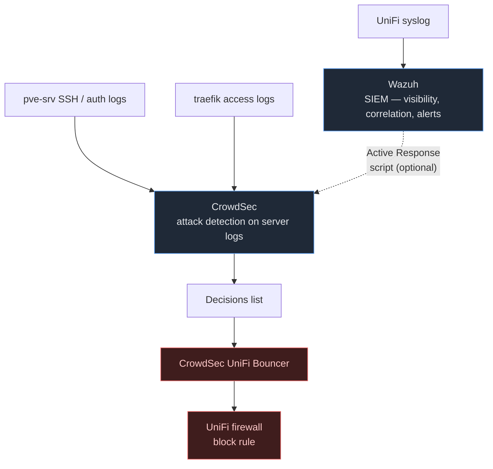

## NetFlow

Settings → CyberSecure → Traffic Logging → NetFlow / IPFIX

NetFlow records connection metadata — source IP, destination IP, protocol, bytes transferred, duration — for every flow through the gateway. It does **not** capture packet content.

**What it gives you:**
- Traffic visibility per VLAN (who's talking to what, how much bandwidth)
- Security: detect beaconing (IoT device phoning home every 5 minutes), lateral movement, unusual port usage
- Post-incident forensics: reconstruct what happened even after logs roll over

**Collector options (you need one, otherwise there's nothing to send to):**

| Collector | Best for |
| --- | --- |
| ntopng CE (free) | Traffic visualization, per-host/VLAN dashboards |
| nfdump / nfcapd | Raw capture + CLI queries |
| Wazuh (with NetFlow plugin) | Correlation with SIEM events |
| Graylog + NetFlow plugin | If you run Graylog already |

**Recommendation:** Enable it and point at ntopng or Wazuh. Without a collector it's useless, so don't enable until the collector is up.

- Protocol: IPFIX (preferred) or NetFlow v9
- Collector port: typically UDP 2055 (ntopng default) or 9995

> [!IMPORTANT] Set Sampling Mode to **Off**
> The gateway offers packet sampling (Hash / Random / Deterministic at a rate like 1:512).
> Sampling exists for high-volume datacenter uplinks where full export would drown the
> collector — it is **wrong for security use**. Beaconing and lateral movement are
> *low-and-slow* signals (a C2 beacon can be one small packet every few minutes); at 1:512
> you will statistically **miss exactly the traffic NetFlow was enabled to catch**. At
> residential homelab flow rates the UXG Max exports every flow easily, so set
> **Sampling Mode → Off** for complete, unsampled capture.
>
> Only the zones you actually want flows from need to be selected. Keep the list trimmed —
> e.g. the sunsetted Provisioning (VLAN 99) zone has no devices and shouldn't be included.

### Hardware Acceleration Cost — why it's safe here

UniFi warns that **NetFlow disables hardware acceleration (offload) and decreases throughput.**
For this network that cost is almost entirely theoretical. The reasoning:

The offload penalty only affects traffic the gateway **routes** — that's WAN and **inter-VLAN**
traffic. It does **not** touch switched **intra-VLAN** traffic, which never reaches the routing/
offload engine at all. The bandwidth-heavy flows here are all deliberately intra-VLAN:

| Flow | VLAN | Switched or routed? | Hit by offload loss? |
| --- | --- | --- | --- |
| PBS ↔ TrueNAS, Longhorn replica sync | Storage (40) | Switched (MTU 9000) | No |
| Corosync heartbeat | Cluster (20) | Switched (no gateway) | No |
| k3s pod / node east-west | k3s (30) | Switched | No |
| WAN (internet) | — | Routed | Capped by Comcast (~≤1.2 Gbps) anyway |
| Inter-VLAN (SSH, web UIs) | various | Routed | Low bandwidth — control traffic only |

So the only routed paths are WAN (residential-capped, and the UXG Max software-routes well past
that) and low-bandwidth management traffic. The scenario the warning is written for — sustained
multi-gig **between VLANs through the gateway** — is exactly what this architecture avoids by
keeping storage/cluster/k3s traffic switched.

**Verdict:** enable it. The security value (beaconing detection, lateral-movement visibility,
forensics) fits the Wazuh/CrowdSec posture, and the throughput cost doesn't land on any path that
matters here. It's instantly reversible — to confirm, run `iperf3` across an inter-VLAN path
before/after; you won't see a meaningful difference at residential-WAN scale.

> [!NOTE]
> If you ever only want bandwidth-over-time graphs (not security flow analysis),
> [`unpoller`](#wan-speed-test--grafana) polls the controller API for throughput metrics and
> does **not** disable offload — but it gives none of the per-flow/beaconing detail, so it's not
> a substitute for the security use case.

### WAN Speed Test → Grafana

UniFi's built-in speed test doesn't export results to external systems directly. Two options:

**Option A — unpoller (UniFi Poller) ✅ (in use):** Polls the UniFi controller API and exports general network metrics (throughput, client counts, switch stats) to InfluxDB or Prometheus. Prebuilt Grafana dashboards exist. Does not export scheduled speed test results specifically.

**Option B (simpler) — standalone speedtest container:** Run a `speedtest-cli` or LibreSpeed container on a cron schedule that writes results directly to your InfluxDB. Completely independent of UniFi, easy to dashboard in Grafana. This is the lower-effort path if you just want WAN speed over time.

---

## Activity Logging — Syslog

Settings → CyberSecure -> Traffic Logging → Activity Logging

### Where to send it: Wazuh (not CrowdSec)

**Send UniFi syslog to Wazuh.**

- **Wazuh** is a SIEM — aggregates logs from many sources, runs correlation rules, and alerts. It has built-in decoders for UniFi/firewall syslog. It can correlate a firewall block on an IP with a failed SSH attempt on the same IP across your other hosts. This is the right target for network appliance logs.
- **CrowdSec** is a collaborative IPS — parses application-layer logs (nginx, traefik, SSH auth) to detect attack patterns. Better suited to individual servers, not the gateway syslog directly.

### Wazuh does NOT auto-block on its own

Wazuh is detection and alerting only. It cannot push a block rule into UniFi or add an IP to CrowdSec by itself.

It does have **Active Response** — a feature that runs a shell script on the Wazuh manager when an alert fires. You can wire that script to call `cscli decisions add --ip <X>`, which feeds into CrowdSec's decision list and gets picked up by the UniFi bouncer. That's custom work but not complex.

### The piece that actually auto-blocks in UniFi: CrowdSec UniFi Bouncer

CrowdSec has a first-party bouncer that reads its decision list and pushes block rules directly into UniFi's firewall automatically. This is the closing link in the chain.

The auto-block path is the solid line: server logs → CrowdSec → decisions → bouncer →
UniFi block. Wazuh sits to the side as detection/alerting only; the dotted line is the
**optional** Active Response bridge that lets a Wazuh alert feed an IP into CrowdSec.

**Summary of roles:**

| Tool | Role | Blocks UniFi? |
| --- | --- | --- |
| Wazuh | SIEM — collect, correlate, alert | No (unless Active Response wired up) |
| CrowdSec | Attack detection on server logs | Yes, via UniFi bouncer |
| CrowdSec UniFi Bouncer | Reads CrowdSec decisions → pushes to UniFi | Yes — this is the auto-block mechanism |
| Wazuh Active Response | Runs scripts on alert | Only if scripted to call CrowdSec API |

### Logging level

UniFi sets verbosity per **category**, each `Normal` / `Verbose` / `Debug`:

| Category | Level | Why |
| --- | --- | --- |
| Device | Normal | AP / switch / gateway state, adoption, provisioning — operational chatter; verbose adds noise with little security value |
| Management | **Verbose** | Admin logins and config changes (who changed which firewall rule). The security-critical audit trail — keep full detail |
| Remote Access | **Verbose** | Cloud / `ui.com` logins are a prime attack surface — full visibility on every remote session |
| System | Normal | System events at baseline; bump only when troubleshooting |

The logic: **Verbose** on the two human/admin-action surfaces (Management, Remote Access)
where forensic detail matters most; **Normal** on the high-volume operational categories
(Device, System) where verbose buys noise, not security.

**Never set Debug as a baseline** anywhere — it floods Wazuh and can tax the gateway. Use
Debug only temporarily on the one category you're actively troubleshooting, then revert.

> [!IMPORTANT]
> These category levels are separate from **per-rule firewall logging**. Ensure DENY rules in
> the firewall have logging enabled — blocked traffic appears in syslog regardless of these
> settings.

### Syslog forwarding config

Settings → System → Logging → Remote Logging:
- Protocol: UDP (standard) or TCP (more reliable, use if Wazuh supports it)
- Port: 514 (syslog default) or your Wazuh syslog listener port
- Destination: Wazuh manager IP

### Netconsole — leave OFF

The **Netconsole** checkbox is *not* a security log source — don't enable it for the SIEM
pipeline. It ships the gateway's raw kernel `printk` output (oopses, panics, hardware faults)
over UDP, and its whole purpose is capturing the messages normal syslog misses **because the
box is crashing before it can flush**. Wazuh has no decoders for it; it's unstructured kernel
noise, not firewall/auth/security events.

Turn it on **only temporarily** if you're chasing an unexplained UXG reboot/crash and want the
kernel trace, pointed at a netconsole receiver (not the syslog/Wazuh listener). Off otherwise.

---

## Data Retention

Settings → System → Maintenance → Data Retention

**Yes, increase it.** Default retention is short and you lose forensic history fast.

| Data type | Recommended retention |
| --- | --- |
| Flow / connection records | 90 days |
| Events and alerts | 180 days |
| IPS / threat events | 180 days |

> [!NOTE]
> Local UniFi retention is the short-term buffer. Long-term storage lives in Wazuh.
> Size the controller VM's disk accordingly — flow data at 90 days can grow significantly
> on a busy network. Monitor disk usage on dock-prod (10.10.10.10) after enabling.
