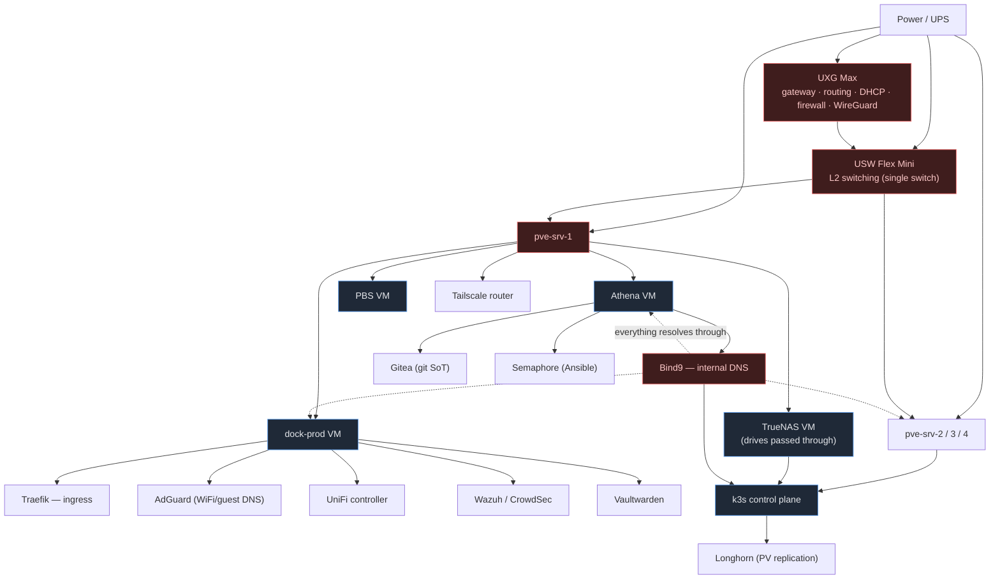

# Dependency Map & Blast Radius

Cross-cutting operational view: what depends on what, what breaks if a thing dies, and the
order to bring things up cold. Pairs with the incident runbooks
([firewall lockout recovery](1-networking/Unifi/Firewall/Recovery.md)).

---

## The one thing to internalize

**pve-srv-1 is the dominant single point of failure.** It hosts Athena *and* dock-prod *and*
TrueNAS *and* PBS *and* the Tailscale router. If srv-1 goes down, you lose — at once — internal
DNS, GitOps (Gitea/Semaphore), Ansible/Terraform, all Docker apps (Traefik, AdGuard, UniFi
controller, Wazuh, CrowdSec, Vaultwarden), the NAS, *and* your backup server. Almost every
recovery tool you'd reach for lives on the node that just failed.

Everything in the "Recommendations" section below orbits reducing that blast radius.

---

## Dependency graph

Red = single point of failure with wide blast radius. Blue = critical service.

---

## Blast radius — "if X dies"

| Component | Host | If it fails… | SPOF? | Mitigation (have / planned) |
| --- | --- | --- | --- | --- |
| **Power** | — | Everything off; risk of unclean ZFS/etcd shutdown → corruption | ✅ | **UPS + NUT graceful shutdown** (planned — highest priority) |
| **UXG Max** | — | No WAN, no inter-VLAN routing, no DHCP, WireGuard down | ✅ | No HA gateway in budget; config backed up; single-WAN |
| **USW Flex Mini** | — | All nodes lose L2 connectivity → cluster partition | ✅ | Single switch — bigger/redundant switch is the end goal |
| **pve-srv-1** | — | DNS, GitOps, Ansible, all Docker apps, NAS, **PBS backups**, Tailscale all down | ✅✅ | **Distribute services** (see recs); Bind9 secondary on k3s removes DNS from this radius |
| pve-srv-2/3/4 | — | Lose k3s capacity; cluster tolerates **1** node (quorum 3, no QDevice) | partial | k3s reschedules; Longhorn replicas ≥2 |
| **Bind9** | Athena | Internal name resolution fails fleet-wide → cascading failures | ✅ | **Bind9 secondary** (planned, on k3s, different host) |
| Gitea / Semaphore | Athena | Can't run Ansible / no git SoT locally | — | GitHub push-mirror is the offsite copy |
| Traefik | dock-prod | All web services unreachable by hostname | ✅ | Multi-replica once on k3s + MetalLB |
| AdGuard | dock-prod | WiFi/guest lose filtered DNS + local resolution | — | Move to k3s; low criticality (infra uses Bind9) |
| UniFi controller | dock-prod | Can't *change* network config; data plane keeps running | — | Not in data path; config auto-backed-up |
| TrueNAS | pve-srv-1 | k3s NFS PVs + backup target gone | ✅ | Drives passed-through = pinned to srv-1; snapshots+replication |
| PBS | pve-srv-1 | No new backups; existing restorable elsewhere | — | Offsite (Synology) target planned |
| k3s control plane | srv-2/3/4 | No scheduling/API; running pods limp on | partial | 3 masters (HA); etcd quorum needs 2/3 |
| Tailscale | pve-srv-1 | Remote access down (WireGuard on UXG is the fallback) | — | WireGuard on gateway = independent path |

---

## Cold-start order (full power-on / DR)

Bring things up in dependency order — skipping ahead causes resolution/scheduling failures:

1. **Power / UPS** stable.
2. **UXG Max** + **USW Flex Mini** — gateway, routing, DHCP, L2 up first.
3. **pve-srv-1** → Proxmox host.
4. **TrueNAS** VM (NFS must be up before k3s storage) + **PBS**.
5. **Athena** VM → **Bind9 first** (everything resolves through it), then Gitea, Semaphore.
6. **dock-prod** VM → Traefik (ingress), AdGuard, UniFi controller, Vaultwarden, Wazuh/CrowdSec.
7. **pve-srv-2/3/4** → k3s VMs → control plane → CNI → CoreDNS → Longhorn → workloads
   (ArgoCD reconciles app state from git once it's in — step 8).
8. **Tailscale** router for remote access (or WireGuard on the gateway as fallback).

> The hard ordering constraint: **Bind9 (on Athena/srv-1) must be up before k3s and most
> services**, because they resolve through it. This is also why the Bind9 secondary belongs on
> a *different* host — so a srv-1 outage doesn't block the rest of the recovery.

---

## Recommendations to shrink the blast radius

Ordered by impact:

1. **UPS + NUT** — protect against unclean shutdown corruption (the power layer underpins
   everything above).
2. **Bind9 secondary on k3s** — removes DNS from the srv-1 blast radius. Already designed in
   [DNS.md](1-networking/Unifi/Networks/DNS.md).
3. **Distribute the srv-1 stack** — the long game. Even moving *one* of {Vaultwarden, a DNS
   instance, ingress} off srv-1 meaningfully shrinks the radius. TrueNAS/PBS are hardware-pinned
   (passthrough), so accept those or plan dedicated storage hardware.
4. **Offsite backups** (Synology) — so a site-level event (fire/theft/power surge) isn't total.
5. **Tested restores + DR runbook** — extend this doc with the actual restore *commands* per
   tier (Proxmox config, VM-from-PBS, k3s state, secrets-from-paper/cloud).
6. **Redundant switch** — when budget allows; removes the single-L2-fabric SPOF.

---

## Related

- [Firewall lockout recovery](1-networking/Unifi/Firewall/Recovery.md)
- [Corosync / cluster quorum](2-proxmox/pve/Corosync.md)
- [DNS target design](1-networking/Unifi/Networks/DNS.md)
- [Network inventory (authoritative IPs/placement)](1-networking/Unifi/Assignments/MAC%20Reservations.md)
